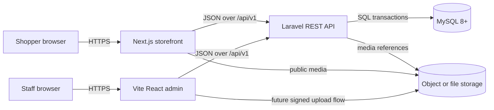
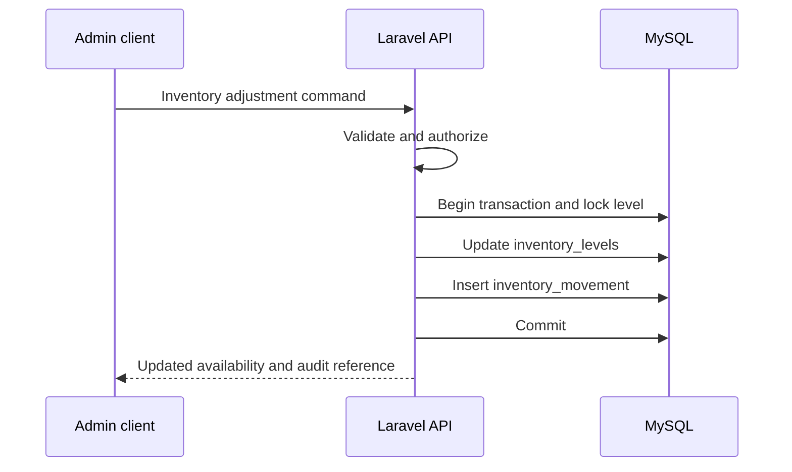

# Noure architecture

## System boundary

Noure is a monorepo containing three independently built applications and one MySQL database:

| Component | Responsibility | Database access |
| --- | --- | --- |
| `frontend/` | Public Next.js storefront and future customer experience | None |
| `admin/` | Internal Vite + React catalog and operations client | None |
| `backend/` | Laravel REST API, validation, authorization, business rules, and persistence | Read/write |
| MySQL | Durable relational data and transactional constraints | Backend only |

The browser applications must never query MySQL or import source code from another application directory. All shared behavior and data cross application boundaries through explicit Laravel API contracts.



## Communication model

### Storefront to backend

The public Next.js application reads catalog and homepage content from versioned, read-oriented REST endpoints. Its API base URL is configured through `NEXT_PUBLIC_API_URL`. Responses should expose stable public identifiers, presentation-ready prices, and only published/active records.

Server-side rendering may call the same API from the Next.js server runtime, but Next.js remains an API consumer and does not receive database credentials. Caching rules must be endpoint-specific so price, availability, and scheduled content do not remain stale beyond their acceptable windows.

Cart, checkout, payment, and customer authentication communications are deliberately not implemented in this phase.

### Admin to backend

The Vite React application communicates with the same Laravel API using `VITE_API_URL`. Future admin endpoints will use separate authorization policies and may expose draft/archived records, inventory audit data, and validation details that are never returned by public endpoints.

The admin application does not enforce business invariants by itself. Client validation improves usability, but Laravel validation and database constraints remain authoritative.

### Backend to database

Laravel is the sole owner of database access. Controllers should translate HTTP requests and responses, form requests should validate inputs, policies should authorize actions once authentication is introduced, and focused service/action classes should coordinate domain rules and transactions.

Expected backend layers are:

```text
HTTP route
  -> controller
    -> request validation / authorization
      -> domain action or service
        -> Eloquent models and database transaction
          -> MySQL constraints and indexes
```

Controllers must remain thin. Cross-entity operations such as creating variant combinations, changing inventory, finalizing orders, and recording payments belong in transaction-aware domain actions rather than controllers or browser clients.

## API contract principles

- Prefix public contracts with `/api/v1` so incompatible changes can be introduced deliberately.
- Use JSON consistently and return ISO 8601 UTC timestamps.
- Expose ULID-style `public_id` values rather than sequential database IDs where entities are externally addressable.
- Use integer minor units and ISO currency codes in writable contracts; responses may additionally provide formatted display values.
- Paginate collection endpoints and set explicit filtering and sorting allowlists.
- Prevent mass assignment of status, totals, stock, and other server-controlled fields.
- Use idempotency keys for future order submission, payment, refund, and inventory-sensitive commands.
- Keep public storefront resources separate from future privileged admin commands, even when both use the same underlying domain model.
- Version and validate JSON snapshots used for order addresses, item options, and provider metadata.

## Catalog and inventory flow

Catalog data is organized as products with category memberships, images, option definitions, and sellable variants. A product variant selects one value for every product option; the database prevents duplicate combinations per product. For example, Color values `Cream` and `Black` combined with Size values `S` and `M` produce four variant records.

Inventory belongs to each variant at an inventory location. Laravel updates the current inventory level and appends an audit movement inside one database transaction. Clients receive availability but never directly set derived available-to-sell quantities.



## Order and payment boundary

The database design includes carts, orders, order items, discounts, and provider-neutral payment records so their relationships are established early. Their workflows are not implemented yet.

When checkout is designed, Laravel must revalidate current variant state, price, discount eligibility, and inventory. It must create immutable order snapshots rather than relying on mutable product, customer address, or discount rows. Payment providers communicate with Laravel—not directly with MySQL—and webhook processing must be authenticated and idempotent.

## Data ownership and security

- Database credentials and payment-provider secrets exist only in backend/deployment configuration.
- `NEXT_PUBLIC_*` and `VITE_*` variables are public browser configuration and must never contain secrets.
- Product images and banners store media references in MySQL; binary objects belong in configured file/object storage.
- Sensitive payment instruments must not be stored. Persist only provider tokens/references and sanitized response metadata.
- Logs must avoid customer personal data, guest cart tokens, credentials, and provider secrets.
- Authentication and authorization are deferred, but future admin and customer identities must not be inferred from request-supplied IDs.

## Deployment and environment separation

Each application is installed, built, and deployed independently. Environment-specific API origins, CORS policies, storage endpoints, database credentials, and cache configuration are supplied at deployment time.

The initial development defaults remain:

| Service | Default URL |
| --- | --- |
| Storefront | `http://localhost:3000` |
| Admin | `http://localhost:5173` |
| Laravel API | `http://localhost:8000` |

MySQL is not exposed to either browser application. Production deployments should terminate TLS at the platform edge, restrict database network access to backend workloads, and run Laravel migrations as an explicit deployment step only after schema changes are implemented and reviewed.

## Current and deferred scope

This architecture phase documents boundaries and the database model. It does not create Laravel migrations or implement API routes, frontend pages, admin UI, authentication, cart behavior, checkout, tax/shipping calculation, payment integrations, background jobs, or deployment infrastructure.

The detailed schema, indexing, slug, soft-delete, and inventory decisions are defined in [database.md](./database.md).
