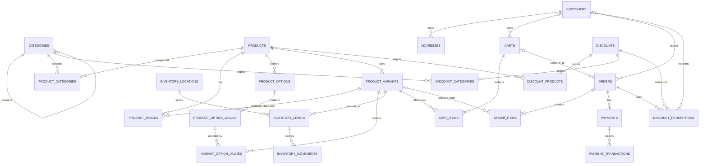

# Database design

## Status and scope

This document defines the initial relational model for the Noure commerce API. It is a design contract only: no Laravel migrations, models, endpoints, authentication, cart workflow, checkout flow, or payment-provider integration are included in this phase.

The design assumes MySQL 8+, InnoDB, `utf8mb4`, UTC timestamps, and foreign-key enforcement. Laravel remains the only service allowed to connect directly to MySQL.

## Proposed assumptions requiring approval

The following choices are documented for review and are not yet migration contracts. They must be approved or revised before schema implementation begins.

- Tables use unsigned `BIGINT` internal primary keys. Entities exposed outside the API may also have a unique ULID `public_id` so database sequences are not exposed.
- Money is stored as integer minor units (`BIGINT`), accompanied by a three-character ISO 4217 currency code. For example, IDR 150,000 is stored as `150000`; currencies with cents store the smallest currency unit.
- Product variants are the sellable and inventory-tracked units. A product without visible choices still owns one default variant.
- Product options are normalized. A variant represents one unique combination of option values, such as `Cream / S`.
- Products may belong to multiple categories and may nominate one category membership as primary.
- Inventory begins with one logical location, but the schema supports additional locations without redesign.
- Customer records do not contain authentication credentials in this phase. Guest carts and orders remain possible.
- Order item, address, pricing, discount, and payment data are historical snapshots and must not be derived from mutable catalog data.
- Media files live in object/file storage; MySQL stores paths, URLs, and metadata only.

The main approval points are the use of ULIDs alongside numeric keys, integer minor-unit money, globally unique category slugs, one-location-ready multi-location inventory, guest-capable carts/orders, order snapshots stored partly as validated JSON, and the deliberately limited first discount model. Alternatives in any of these areas can materially change migrations and API contracts.

## Entity relationship diagram

## Table definitions

Unless noted otherwise, tables include `id`, `created_at`, and `updated_at`. Foreign-key columns should use the same unsigned type as their referenced primary keys.

### Catalog

#### `categories`

| Field | Type | Notes |
| --- | --- | --- |
| `id` | BIGINT UNSIGNED | Primary key |
| `public_id` | CHAR(26) | Unique ULID exposed through the API |
| `parent_id` | BIGINT UNSIGNED, nullable | Self-reference for category trees |
| `name` | VARCHAR(160) | Display name |
| `slug` | VARCHAR(180) | URL-safe identifier |
| `description` | TEXT, nullable | Category copy |
| `image_path` | VARCHAR(2048), nullable | Storage path or CDN URL |
| `sort_order` | INT UNSIGNED | Sibling ordering, default `0` |
| `is_active` | BOOLEAN | Controls storefront visibility |
| `deleted_at` | TIMESTAMP, nullable | Soft delete |

Indexes: unique `public_id`; index `parent_id`; index `(parent_id, sort_order)`; index `(is_active, deleted_at)`; slug uniqueness as described under **Slug strategy**.

#### `products`

| Field | Type | Notes |
| --- | --- | --- |
| `id` | BIGINT UNSIGNED | Primary key |
| `public_id` | CHAR(26) | Unique external identifier |
| `name` | VARCHAR(200) | Product name |
| `slug` | VARCHAR(220) | Storefront URL key |
| `short_description` | VARCHAR(500), nullable | Listing copy |
| `description` | LONGTEXT, nullable | Full product content |
| `status` | VARCHAR(30) | `draft`, `active`, or `archived` |
| `brand` | VARCHAR(160), nullable | Denormalized brand label until brands become entities |
| `published_at` | TIMESTAMP, nullable | Scheduled/publication time |
| `metadata` | JSON, nullable | Non-critical extensibility only |
| `deleted_at` | TIMESTAMP, nullable | Soft delete |

Indexes: unique `public_id`; index `(status, published_at, deleted_at)`; index `name`; slug uniqueness as described below. Do not put option, price, or stock fields on this table.

#### `product_categories`

| Field | Type | Notes |
| --- | --- | --- |
| `product_id` | BIGINT UNSIGNED | FK to products |
| `category_id` | BIGINT UNSIGNED | FK to categories |
| `is_primary` | BOOLEAN | One membership per product should be primary |
| `sort_order` | INT UNSIGNED | Product ordering within category |

Primary/unique key: `(product_id, category_id)`. Index `(category_id, sort_order)`. Because MySQL cannot express “one true row per product” with a simple portable constraint, the application must change primary membership transactionally.

#### `product_images`

| Field | Type | Notes |
| --- | --- | --- |
| `product_id` | BIGINT UNSIGNED | Required product owner |
| `variant_id` | BIGINT UNSIGNED, nullable | Optional variant-specific image |
| `path` | VARCHAR(2048) | Storage key or URL |
| `alt_text` | VARCHAR(255), nullable | Accessibility text |
| `width` / `height` | INT UNSIGNED, nullable | Source dimensions |
| `mime_type` | VARCHAR(100), nullable | Example: `image/webp` |
| `sort_order` | INT UNSIGNED | Gallery order |
| `is_primary` | BOOLEAN | Product/variant preferred image |

Indexes: `(product_id, sort_order)` and `(variant_id, sort_order)`. The application must verify that a referenced variant belongs to the same product.

#### `product_options`

Defines dimensions such as Color or Size.

| Field | Type | Notes |
| --- | --- | --- |
| `product_id` | BIGINT UNSIGNED | Owning product |
| `name` | VARCHAR(100) | Display label, e.g. `Color` |
| `code` | VARCHAR(100) | Stable normalized key, e.g. `color` |
| `sort_order` | INT UNSIGNED | Display/combination order |

Unique `(product_id, code)`; index `(product_id, sort_order)`.

#### `product_option_values`

| Field | Type | Notes |
| --- | --- | --- |
| `product_option_id` | BIGINT UNSIGNED | Parent option |
| `label` | VARCHAR(120) | Customer-facing value, e.g. `Cream` |
| `code` | VARCHAR(120) | Stable normalized value |
| `swatch_value` | VARCHAR(100), nullable | Hex color or media reference |
| `sort_order` | INT UNSIGNED | Display order |

Unique `(product_option_id, code)`; index `(product_option_id, sort_order)`.

#### `product_variants`

| Field | Type | Notes |
| --- | --- | --- |
| `id` | BIGINT UNSIGNED | Primary key |
| `public_id` | CHAR(26) | Unique external identifier |
| `product_id` | BIGINT UNSIGNED | Owning product |
| `sku` | VARCHAR(100) | Globally unique stock-keeping unit |
| `title` | VARCHAR(255), nullable | Generated/readable combination label |
| `combination_key` | VARCHAR(500) | Canonical option-value ID signature |
| `price_amount` | BIGINT UNSIGNED | Current selling price in minor units |
| `compare_at_amount` | BIGINT UNSIGNED, nullable | Optional struck-through price |
| `currency` | CHAR(3) | ISO 4217 code |
| `barcode` | VARCHAR(100), nullable | UPC/EAN/etc. |
| `weight_grams` | INT UNSIGNED, nullable | Shipping input |
| `is_default` | BOOLEAN | Default selection for product |
| `is_active` | BOOLEAN | Whether variant may be sold |
| `deleted_at` | TIMESTAMP, nullable | Soft delete |

Indexes: unique `public_id`; unique `sku`; unique `(product_id, combination_key)`; index `(product_id, is_active, deleted_at)`; optional unique `barcode` when non-null.

`combination_key` is produced by sorting selected `product_option_values.id` values by their option `sort_order`, then joining the IDs (for example `14:27`). It is a concurrency-safe uniqueness aid, not storefront copy.

#### `variant_option_values`

| Field | Type | Notes |
| --- | --- | --- |
| `variant_id` | BIGINT UNSIGNED | Variant |
| `product_option_value_id` | BIGINT UNSIGNED | Selected value |

Primary/unique key `(variant_id, product_option_value_id)`; index `product_option_value_id`. Domain validation must ensure exactly one value per product option and that all records belong to the same product.

Example combinations are represented as four variants:

| Variant | Selected values |
| --- | --- |
| Cream / S | Color: Cream; Size: S |
| Cream / M | Color: Cream; Size: M |
| Black / S | Color: Black; Size: S |
| Black / M | Color: Black; Size: M |

### Inventory

#### `inventory_locations`

Fields: `id`, unique `code`, `name`, nullable address/contact metadata, and `is_active`. Seed one location such as `MAIN`. This avoids hard-coding a single warehouse into variants.

#### `inventory_levels`

| Field | Type | Notes |
| --- | --- | --- |
| `variant_id` | BIGINT UNSIGNED | Stocked variant |
| `location_id` | BIGINT UNSIGNED | Storage location |
| `on_hand` | INT UNSIGNED | Physically recorded units |
| `reserved` | INT UNSIGNED | Units held for active ordering workflows |
| `safety_stock` | INT UNSIGNED | Units intentionally unavailable for sale |
| `version` | INT UNSIGNED | Optimistic-lock counter |

Unique `(variant_id, location_id)`; index `(location_id, variant_id)`. Available quantity is calculated as `GREATEST(on_hand - reserved - safety_stock, 0)` and is not independently writable.

#### `inventory_movements`

An append-only audit ledger with `inventory_level_id`, signed `quantity_delta`, `movement_type` (`receipt`, `adjustment`, `reservation`, `release`, `sale`, `return`), nullable `reference_type`/`reference_id`, `reason`, nullable `actor_id`, and `created_at`. Index `(inventory_level_id, created_at)` and `(reference_type, reference_id)`. Rows are never updated or deleted.

Inventory mutations must run in database transactions and lock or version-check the affected `inventory_levels` row. Reservations cannot make available stock negative. Expired/failed reservations are released explicitly and recorded in the ledger.

### Customers and addresses

#### `customers`

Fields: `id`, unique `public_id`, nullable unique normalized `email`, nullable `phone`, `first_name`, `last_name`, `status` (`active`, `blocked`, `archived`), nullable `marketing_consent_at`, nullable `last_order_at`, timestamps, and `deleted_at`. Authentication credentials are deliberately absent.

Indexes: normalized email; phone; `(status, deleted_at)`.

#### `addresses`

Fields: `id`, `public_id`, `customer_id`, optional label, recipient name, phone, `line1`, nullable `line2`, `city`, nullable province/state, postal code, ISO 3166-1 alpha-2 country code, `is_default_shipping`, `is_default_billing`, timestamps, and `deleted_at`.

Indexes: `(customer_id, deleted_at)` and `(customer_id, is_default_shipping)`. Default selection is enforced transactionally. Addresses are copied into orders rather than referenced as the historical source of truth.

### Carts

#### `carts`

Fields: `id`, unique `public_id`, nullable `customer_id`, unique nullable high-entropy `guest_token_hash`, `status` (`active`, `converted`, `abandoned`, `expired`), `currency`, nullable `email`, `expires_at`, nullable `converted_at`, and timestamps.

Indexes: `(customer_id, status)`, `guest_token_hash`, and `(status, expires_at)`. Only a hash of a guest token is stored. Cart ownership rules will be defined with authentication/checkout work.

#### `cart_items`

Fields: `id`, `cart_id`, `variant_id`, positive `quantity`, nullable `unit_price_snapshot`, nullable `currency`, and timestamps. Unique `(cart_id, variant_id)`; index `variant_id`. Snapshot prices are advisory for change detection—the backend must reprice and revalidate stock before checkout.

### Orders

#### `orders`

| Field group | Important fields |
| --- | --- |
| Identity | `id`, `public_id`, unique human-readable `order_number`, nullable `cart_id`, nullable `customer_id` |
| State | `status`, `payment_status`, `fulfillment_status`, `placed_at`, nullable `cancelled_at` |
| Contact | `email`, nullable `phone` |
| Totals | `currency`, `subtotal_amount`, `discount_amount`, `shipping_amount`, `tax_amount`, `grand_total_amount` |
| Addresses | `billing_address` JSON, `shipping_address` JSON |
| Context | nullable `customer_note`, nullable `internal_note`, nullable `metadata` JSON |

Indexes: unique `public_id`; unique `order_number`; `(customer_id, created_at)`; `(status, created_at)`; `(payment_status, created_at)`; `(fulfillment_status, created_at)`. Orders are never soft-deleted.

Address JSON is a validated immutable snapshot with an explicit schema/version. It avoids historical order data changing when a customer edits an address.

#### `order_items`

Fields: `id`, `order_id`, nullable `product_id`, nullable `variant_id`, immutable snapshots (`product_name`, `variant_name`, `sku`, `option_values` JSON), positive `quantity`, `unit_price_amount`, `subtotal_amount`, `discount_amount`, `tax_amount`, `total_amount`, `currency`, and timestamps.

Indexes: `order_id`, `variant_id`, and `sku`. Foreign keys to mutable catalog rows use `SET NULL`; snapshot fields remain authoritative.

### Payments

#### `payments`

One order may have multiple payment attempts. Fields: `id`, `public_id`, `order_id`, `provider`, nullable `provider_payment_id`, `method_type`, `status` (`pending`, `authorized`, `paid`, `failed`, `cancelled`, `partially_refunded`, `refunded`), `amount`, `currency`, nullable `authorized_at`, `paid_at`, `failed_at`, `failure_code`, `failure_message`, idempotency key, metadata JSON, and timestamps.

Indexes: unique `public_id`; unique `(provider, provider_payment_id)` when present; unique idempotency key; `(order_id, status)`. Provider secrets and full card/bank credentials must never be stored.

#### `payment_transactions`

Append-only provider events and money movements. Fields: `payment_id`, `type` (`authorization`, `capture`, `refund`, `void`, `failure`), `status`, signed/typed `amount`, `currency`, provider transaction ID, idempotency key, response metadata JSON with sensitive values removed, and `processed_at`.

Indexes: `(payment_id, processed_at)`; unique `(provider transaction scope, provider_transaction_id)`; unique idempotency key.

### Discounts

#### `discounts`

Fields: `id`, `public_id`, case-insensitive unique normalized `code`, `name`, `description`, `type` (`percentage`, `fixed_amount`), `value` (percentage basis points or minor-unit amount), nullable `currency` for fixed discounts, nullable `minimum_order_amount`, nullable `maximum_discount_amount`, `usage_limit`, `usage_limit_per_customer`, `used_count`, `starts_at`, `ends_at`, `is_active`, timestamps, and `deleted_at`.

Indexes: unique normalized code; `(is_active, starts_at, ends_at, deleted_at)`. Percentages use basis points: `1500` means 15.00%. `used_count` is a guarded cache; redemptions are authoritative.

#### `discount_products` and `discount_categories`

Join tables with unique `(discount_id, product_id)` and `(discount_id, category_id)` respectively. With no target rows, a discount applies order-wide. Combining multiple discounts and complex rule trees are deferred until checkout requirements are approved.

#### `discount_redemptions`

Fields: `discount_id`, `order_id`, nullable `customer_id`, normalized `code_snapshot`, `amount`, `currency`, and `created_at`. Unique `(discount_id, order_id)`; indexes `(customer_id, discount_id)` and `order_id`. Create the redemption in the same transaction that finalizes an order.

### Homepage content

#### `banners`

Fields: `id`, `public_id`, `name` (internal), `placement` (for example `home_hero`), nullable `headline`, `subheading`, `cta_label`, `cta_url`, required desktop image path, nullable mobile image path, nullable alt text, `sort_order`, `is_active`, nullable `starts_at`, `ends_at`, metadata JSON, timestamps, and `deleted_at`.

Indexes: unique `public_id`; `(placement, is_active, starts_at, ends_at, sort_order, deleted_at)`. The API returns only active banners whose schedule includes the current time. URLs must be validated against an allowlist of supported internal paths/protocols.

## Relationship and deletion rules

- Parent deletion is restricted when it would erase transactional meaning.
- Catalog joins and dependent draft data may cascade when their owning, never-published record is permanently purged by an explicit maintenance process.
- Catalog references from `order_items` use `SET NULL`; snapshots preserve the sale.
- Customers referenced by orders are not hard-deleted during normal operation. Privacy erasure should anonymize personal fields while retaining legally required transactional data.
- Deleting a product does not delete orders, payments, redemptions, or inventory movements.
- Soft-deleted records are excluded from normal storefront/admin queries but remain addressable for audit and restore operations.

## Slug strategy

1. Generate lowercase kebab-case slugs from the display name.
2. Normalize Unicode consistently and remove unsupported punctuation.
3. Resolve collisions deterministically with `-2`, `-3`, and so on.
4. Treat slugs as case-insensitive under the selected MySQL collation.
5. Enforce active-record uniqueness using a generated nullable column such as `active_slug = IF(deleted_at IS NULL, slug, NULL)` with a unique index on `active_slug`. This permits reuse after soft deletion while preventing concurrent duplicates.
6. Use `public_id`, not slug, for durable API relationships. A future `slug_redirects` table may retain old URLs when SEO requirements are implemented.

Category slugs are initially globally unique. If nested path-scoped slugs become a requirement, introduce a materialized path/closure strategy deliberately rather than inferring URLs recursively on every request.

## Soft delete strategy

Use Laravel-style nullable `deleted_at` on categories, products, variants, customers, addresses, discounts, and banners. Product options and values follow their product lifecycle and are not independently exposed once their product is deleted.

Do not soft-delete orders, order items, payments, payment transactions, inventory movements, discount redemptions, or other audit records. Their status and retention policy describe lifecycle. Hard purges must be separate, authorized maintenance operations and must respect legal/accounting retention requirements.

## Inventory strategy

- Stock is owned by a variant/location pair, never by the product.
- `on_hand` reflects physical stock, `reserved` reflects temporary allocations, and `safety_stock` is withheld from sale.
- Available-to-sell is derived and cannot be directly edited.
- Every quantity change creates an inventory movement in the same transaction as the level update.
- Writes lock the inventory row (`SELECT ... FOR UPDATE`) or use the `version` field for optimistic concurrency.
- Reservation creation, expiry, checkout conversion, cancellation, and return are explicit movement types.
- The inventory ledger is operational history, while `inventory_levels` is the fast current-state projection. Reconciliation can rebuild/verify the projection from movements.
- Negative availability is rejected. Whether physical `on_hand` may become negative during reconciliation should be an explicit admin policy and defaults to disallowed.

## Naming and data conventions

- Use plural `snake_case` table names and singular `_id` foreign keys.
- Store timestamps in UTC and serialize API timestamps as ISO 8601.
- Use explicit string status values through application enums; migrations may use `VARCHAR` plus checks to make future additions safer than native MySQL `ENUM` changes.
- JSON is reserved for immutable snapshots, provider metadata, or genuinely unstructured presentation metadata—not core searchable relationships.
- Normalize emails and discount codes before uniqueness checks.
- Foreign keys should be indexed, even when not covered by the leading columns of another index.

## Deferred decisions

These are intentionally outside the initial schema implementation and require separate approval: authentication/identity provider, tax calculation, shipping/fulfillment, multi-currency pricing, product bundles, backorders, discount stacking, gift cards, payment gateway selection, refunds workflow, SEO redirect history, and privacy-retention schedules.
